## 基于Java+SSM的宠物领养管理系统619

## 一、系统介绍

本项目分为管理员与普通用户两种角色

管理员角色包含以下功能：

- 用户管理
- 管理员管理
- 宠物管理
- 领养管理
- 评论管理
- 志愿者申请管理
- 活动管理

用户角色包含以下功能：

- 宠物列表
- 申请领养宠物
- 宠物知识学习
- 志愿者申请
- 登录、注册

## 二、所用技术

后端技术栈：

- ssm(Spring+SpringMvc+Mybatis)
- mysql

前端技术栈：

- jsp
- bootstrap

## 三、环境介绍

基础环境 :IDEA/eclipse, JDK 1.8, Mysql5.7,Maven3.6,tomcat8.5

所有项目以及源代码本人均调试运行无问题 可支持远程调试运行

## 四、页面截图

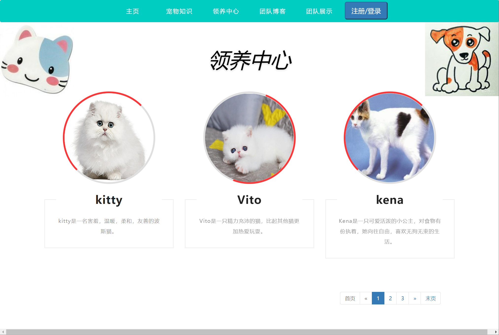

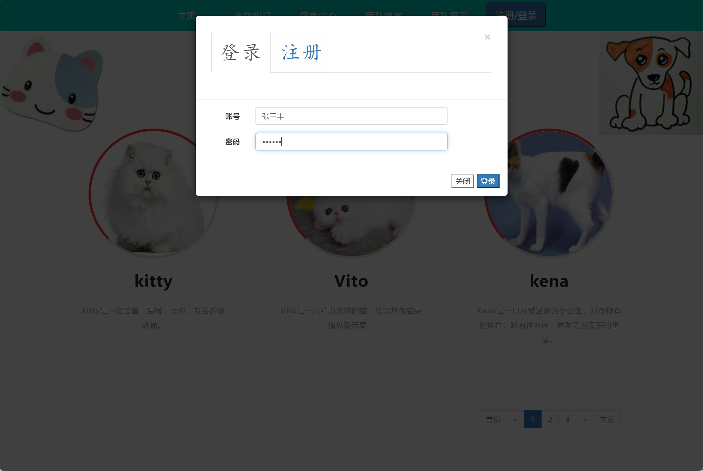

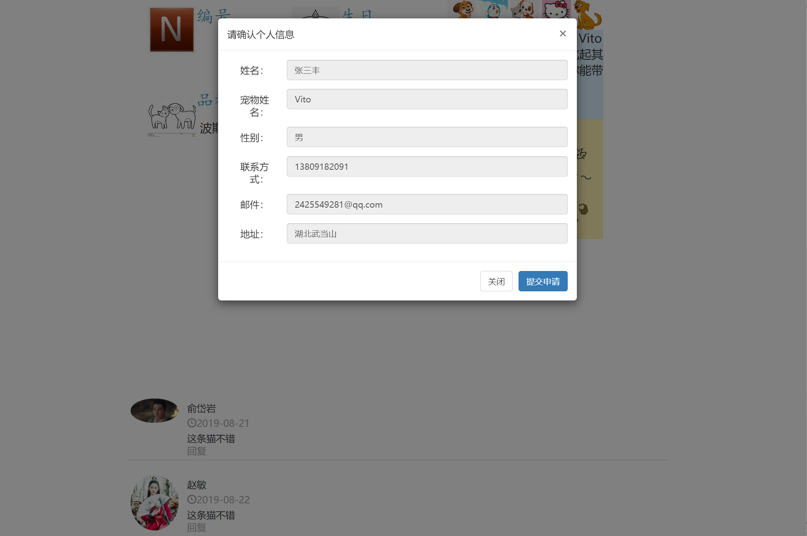

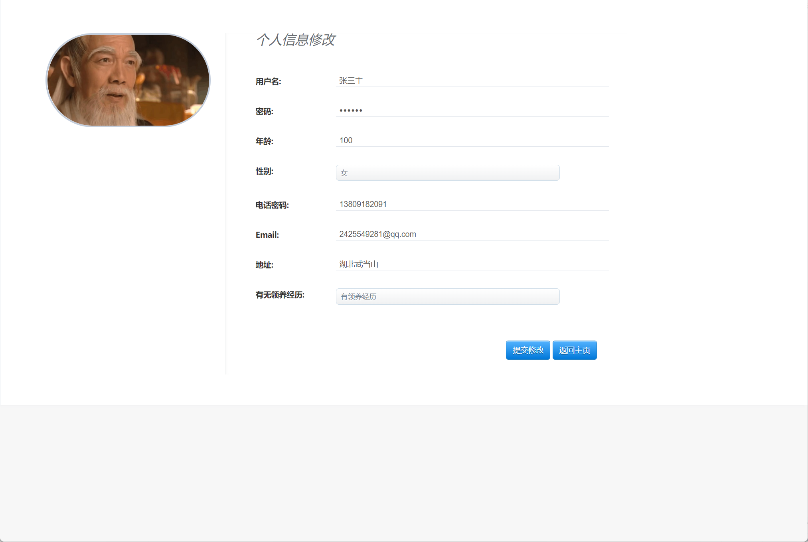

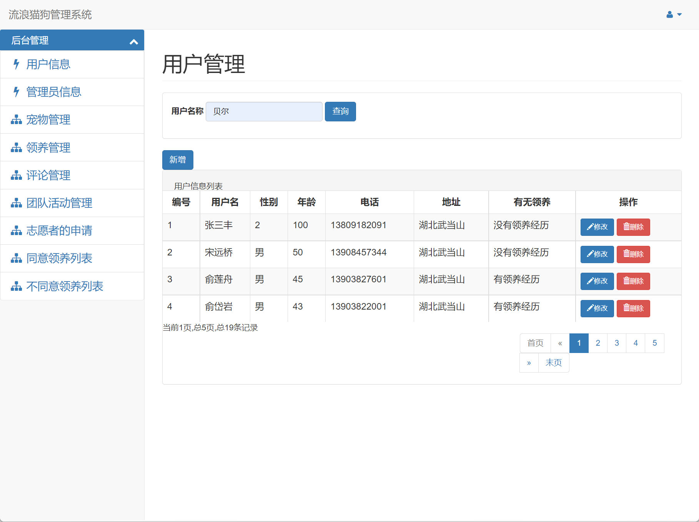

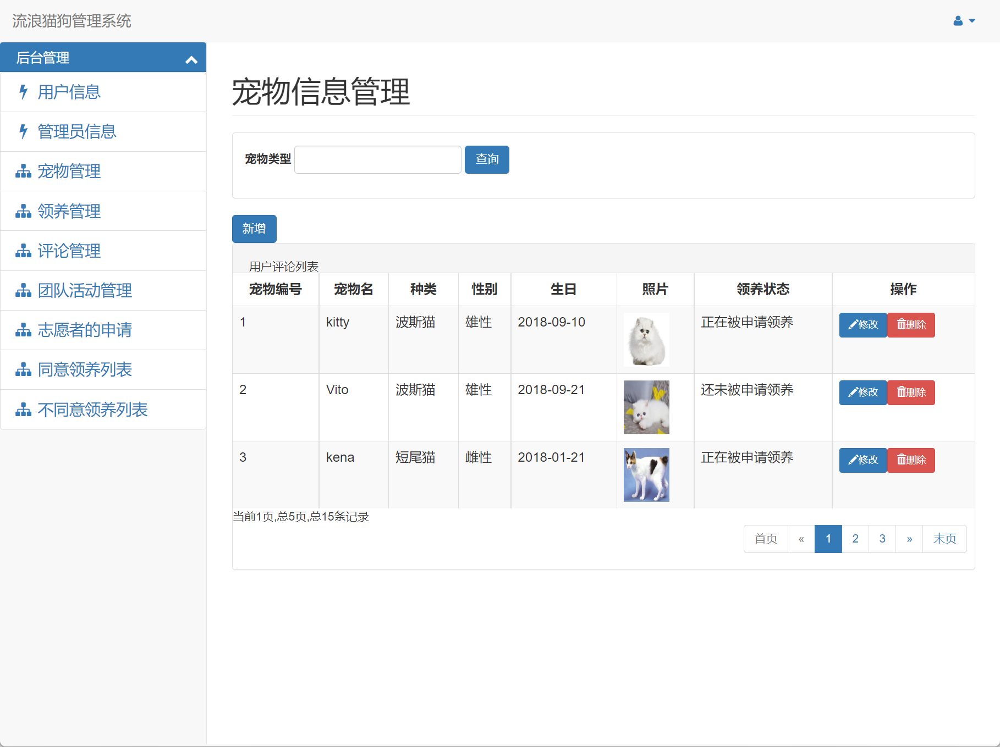

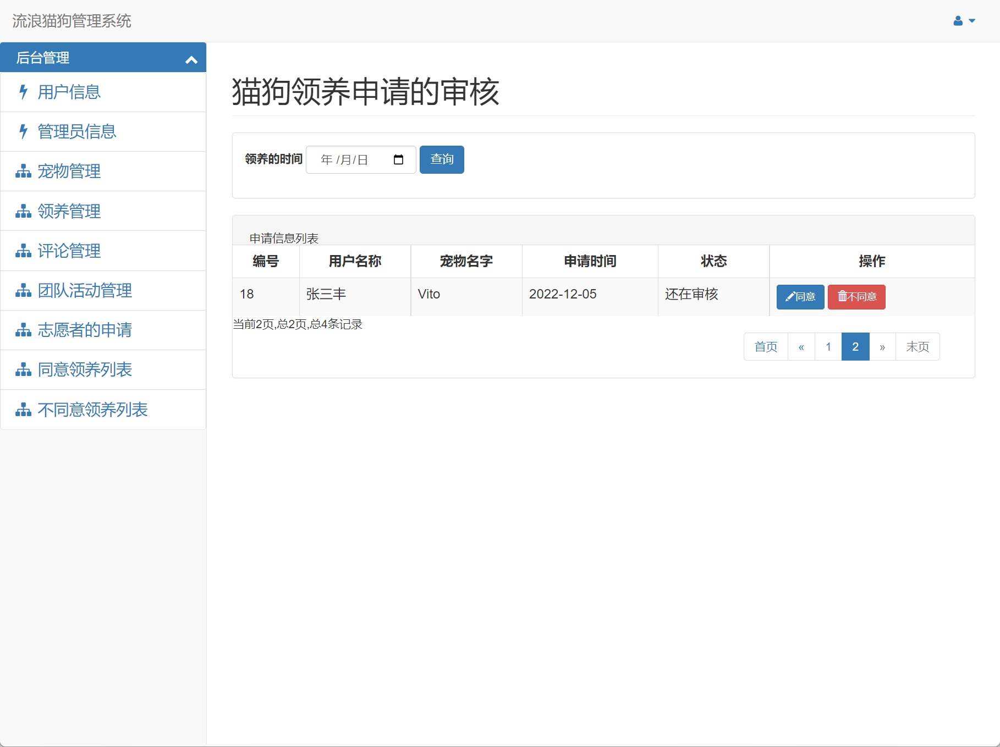

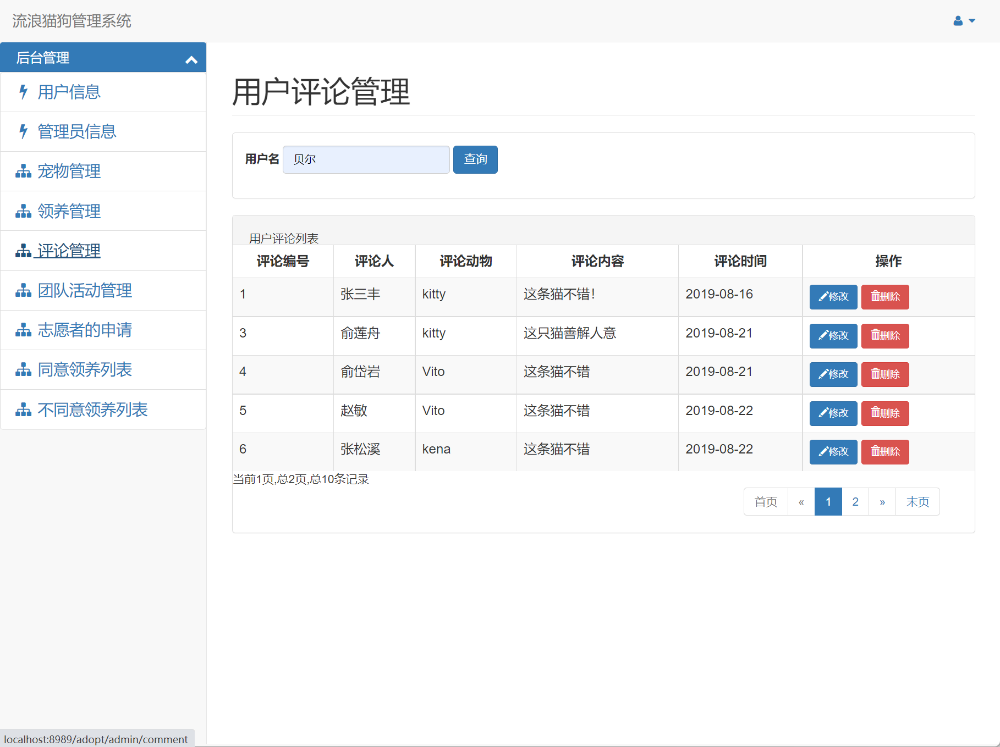

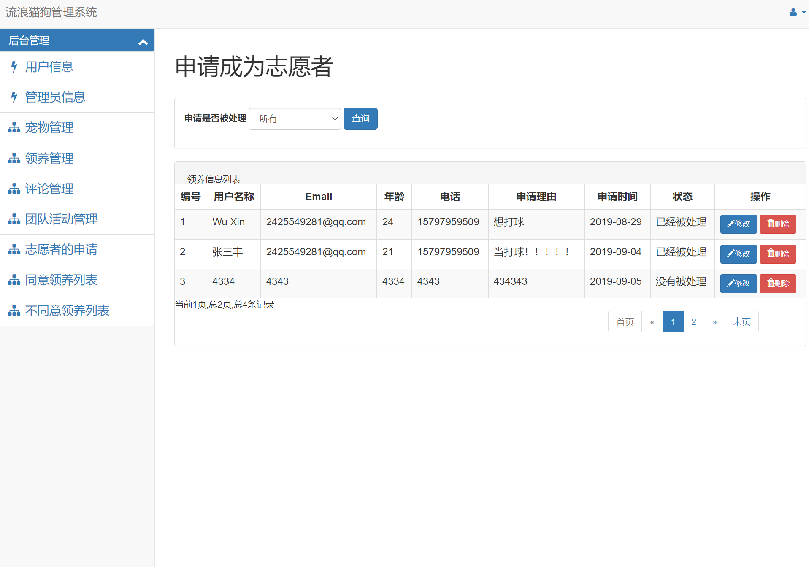

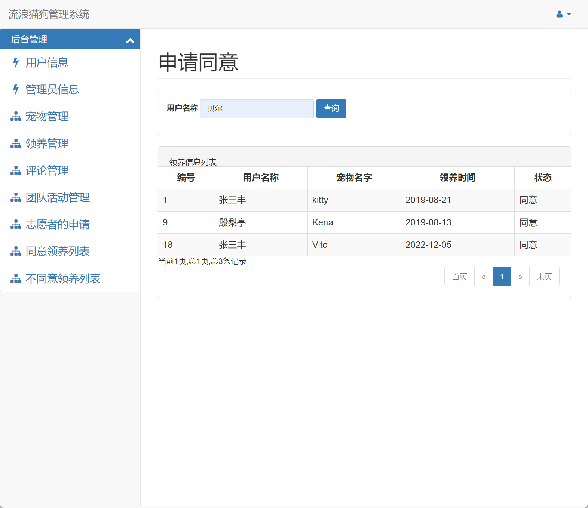

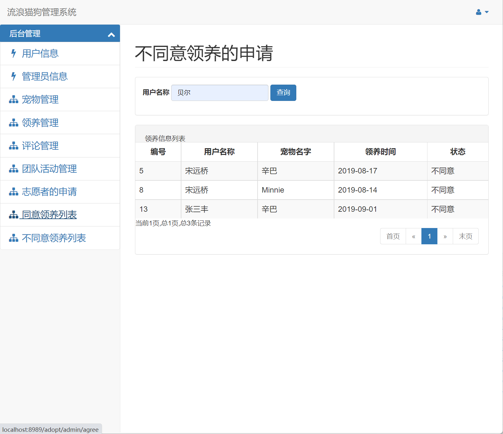

## 五、浏览地址

前端访问地址：http://localhost:8989/adopt/user/index

用户账号/密码：张三丰/zsf123

管理端访问地址：http://localhost:8989/adopt/admin/login

管理员账号/密码：贝尔/1111

## 六、安装教程

1. 使用Navicat或者其它工具，在mysql中创建对应名称的数据库，并执行项目的sql文件里面的sql；
2. 使用IDEA/Eclipse导入项目，导入时，若为maven项目请选择maven; 导入成功后请执行maven clean;maven install命令，然后运行；
3. 修改database.properties 里面的数据库配置
4. 启动项目后端项目

